# MEDIÇÕES DO SLA

## Get Prova
**Tipo de operações:** leitura

**Arquivos envolvidos:** [ProvaController.java](https://github.com/Edhet/enem-questions/blob/feature/teste_de_carga/back-end/src/main/java/com/ablhds/Enemquestions/prova/ProvaController.java)

**Arquivos com o código fonte de medição do SLA:** [Get-Prova.js](https://github.com/Edhet/enem-questions/blob/feature/teste_de_carga/test/script_k6/scenarios/Get-Prova.js)

**Descrição das configurações:**
- Especificação do Computador:
    - Placa-Mãe: RB Jimny_RBH
    - CPU: Ryzen 5 7535HS 
    - GPU: NVIDIA RTX3050
    - Memória RAM: 1x8 GB 5600MHz
- Especificação dos Conteiners:
    - Nginx:  "image: 'nginx:1.25.5'"
    - Postgres: "image: 'postgres:alpine3.19'"
    - Redis: "image: 'redis:alpine3.19'"
    - Backend: "dockerfile: ./Dockerfile"

**\_MEDIÇÃO 1\_:**

**Data da medição:** 07/08/2024

**Testes de carga (SLA):** 
- Latência (100 VUs; 500 VUs; 1000 VUs): 16.35s; 22s ; 28.36s

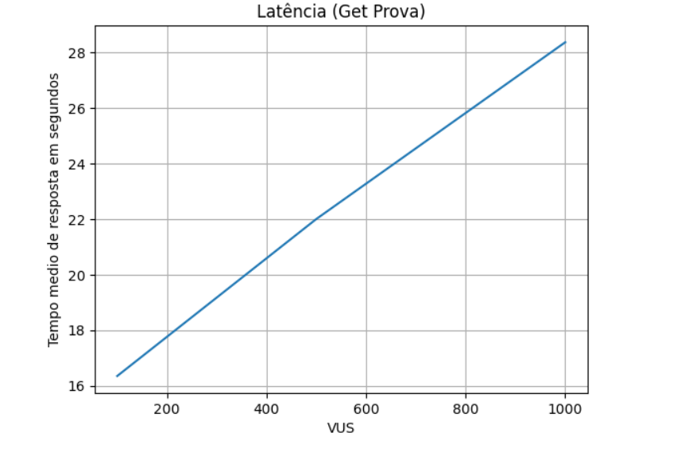

- Vazão (100 VUs; 500 VUs; 1000 VUs): 5.245761/s; 13.887726/s; 23.49267/s

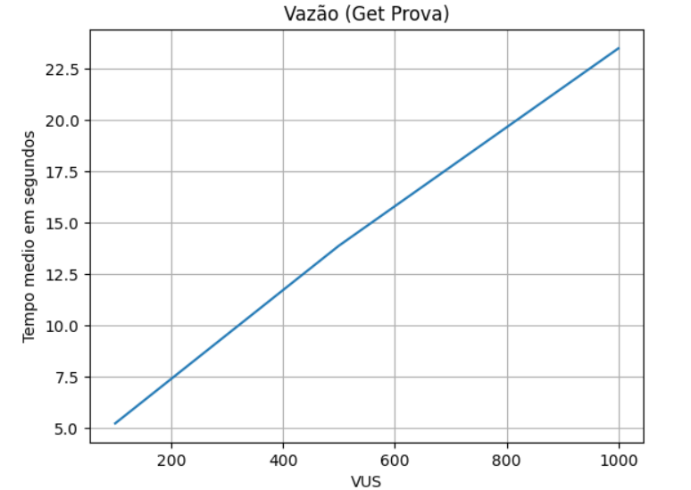

- Concorrência (100 VUs; 500 VUs; 1000 VUs): 90; 138; 190

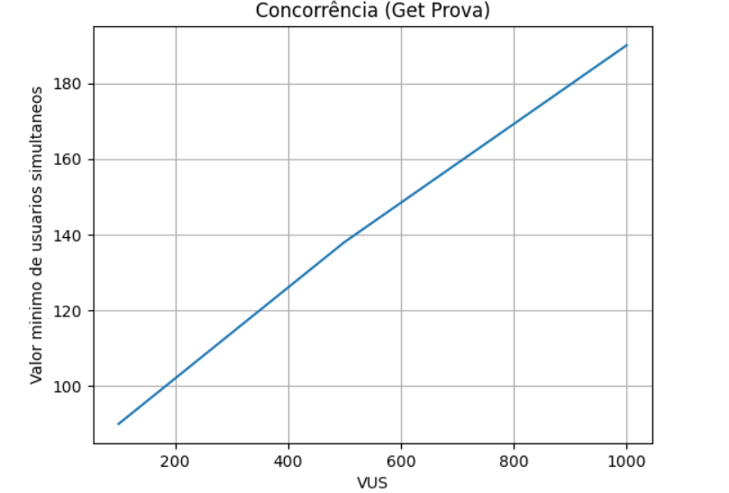

**Potenciais gargalos do sistema:** Não ter cache de informação do usuário para realizar autenticação.

**\_MEDIÇÃO 2\_:**

**Data da medição:** 20/08/2024

**Testes de carga (SLA):** 
- Latência (100 VUs; 500 VUs; 1000 VUs): 70,65s; 24,77s ; 23,34s

- Vazão (100 VUs; 500 VUs; 1000 VUs): 48,101014/s; 242,862487/s; 485,989721/s

- Concorrência (100 VUs; 500 VUs; 1000 VUs): 100; 192; 561

- Teste 1 

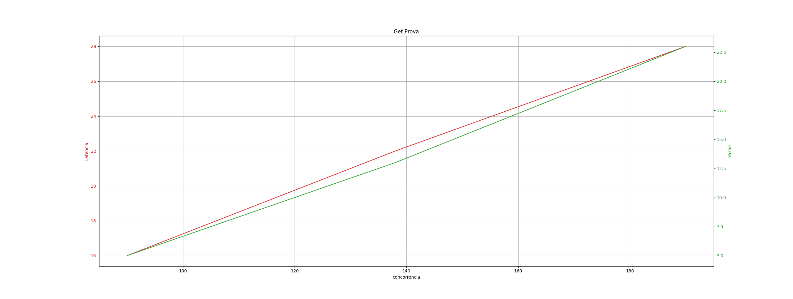

- Teste 2

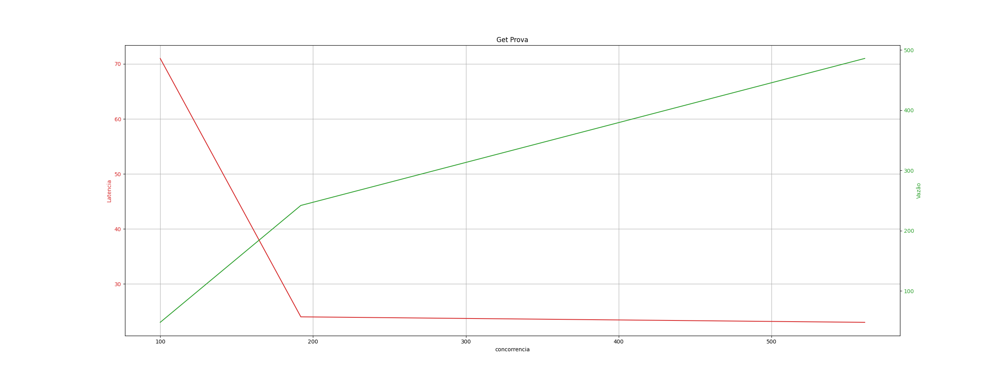

**Melhorias/Otimizações:** 
- A taxa de requisições sendo processadas por segundo aumentou drasticamente.
- A quantidade de usuários virtuais ativos em cada momento teve um aumento considerável.

## Post Get Prova
**Tipo de operações:** inserção e leitura

**Arquivos envolvidos:** [ProvaController.java](https://github.com/Edhet/enem-questions/blob/feature/teste_de_carga/back-end/src/main/java/com/ablhds/Enemquestions/prova/ProvaController.java)

**Arquivos com o código fonte de medição do SLA:** [Post-Get-Prova.js](https://github.com/Edhet/enem-questions/blob/feature/teste_de_carga/test/script_k6/scenarios/Post-Get-Prova.js)

**Data da medição:** 20/08/2024

**Descrição das configurações:**
- Especificação do Computador:
    - Placa-Mãe: RB Jimny_RBH
    - CPU: Ryzen 5 7535HS 
    - GPU: NVIDIA RTX3050
    - Memória RAM: 1x8 GB 5600MHz
- Especificação dos Conteiners:
    - Nginx:  "image: 'nginx:1.25.5'"
    - Postgres: "image: 'postgres:alpine3.19'"
    - Redis: "image: 'redis:alpine3.19'"
    - Backend: "dockerfile: ./Dockerfile"

**\_MEDIÇÃO 1\_:**

**Testes de carga (SLA):** 
- Latência (100 VUs; 500 VUs; 1000 VUs): 325,51s; 12,64s ; 25,85s

- Vazão (100 VUs; 500 VUs; 1000 VUs): 72,708103/s; 34,288292/s; 32,73/s

- Concorrência (100 VUs; 500 VUs; 1000 VUs): 1; 59; 859

- Teste 1

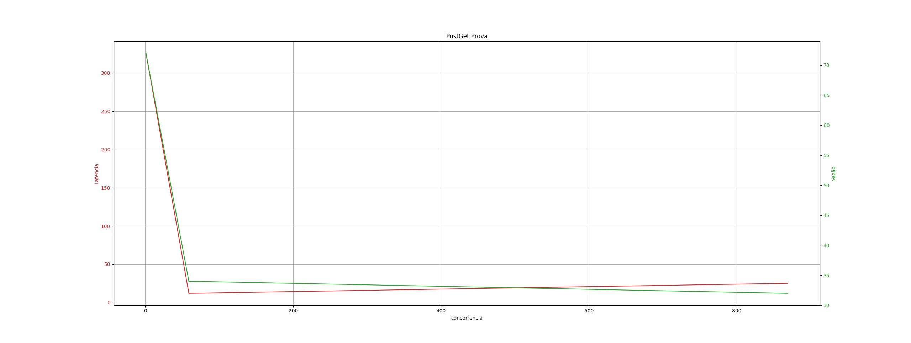

**Potenciais gargalos do sistema:** Quantidade elevada de provas no banco de dados pode acabar afetando o desempenho da busca.

## Post Prova
**Tipo de operações:** inserção

**Arquivos envolvidos:** [ProvaController.java](https://github.com/Edhet/enem-questions/blob/feature/teste_de_carga/back-end/src/main/java/com/ablhds/Enemquestions/prova/ProvaController.java)

**Arquivos com o código fonte de medição do SLA:** [Post-Prova.js](https://github.com/Edhet/enem-questions/blob/feature/teste_de_carga/test/script_k6/scenarios/Post-Prova.js)

**Data da medição:** 07/08/2024

**Descrição das configurações:**
- Especificação do Computador:
    - Placa-Mãe: RB Jimny_RBH
    - CPU: Ryzen 5 7535HS 
    - GPU: NVIDIA RTX3050
    - Memória RAM: 1x8 GB 5600MHz
- Especificação dos Conteiners:
    - Nginx:  "image: 'nginx:1.25.5'"
    - Postgres: "image: 'postgres:alpine3.19'"
    - Redis: "image: 'redis:alpine3.19'"
    - Backend: "dockerfile: ./Dockerfile"

**Testes de carga (SLA):** 
- Latência (100 VUs; 500 VUs; 1000 VUs): 0.23637s; 1.45s ; 3.42s

- Vazão (100 VUs; 500 VUs; 1000 VUs): 78.948975/s; 202.34887/s; 221.660231/s

- Concorrência (100 VUs; 500 VUs; 1000 VUs): 5; 237; 435

**Potenciais gargalos do sistema:** Não ter cache de informação do usuário para realizar autenticação.

## Post Login
**Tipo de operações:** inserção

**Arquivos envolvidos:** [AuthController.java](https://github.com/Edhet/enem-questions/blob/feature/teste_de_carga/back-end/src/main/java/com/ablhds/Enemquestions/security/AuthController.java)

**Arquivos com o código fonte de medição do SLA:** [Post-Login.js](https://github.com/Edhet/enem-questions/blob/feature/teste_de_carga/test/script_k6/scenarios/Post-Login.js)

**Data da medição:** 07/08/2024

**Descrição das configurações:**
- Especificação do Computador:
    - Placa-Mãe: RB Jimny_RBH
    - CPU: Ryzen 5 7535HS 
    - GPU: NVIDIA RTX3050
    - Memória RAM: 1x8 GB 5600MHz
- Especificação dos Conteiners:
    - Nginx:  "image: 'nginx:1.25.5'"
    - Postgres: "image: 'postgres:alpine3.19'"
    - Redis: "image: 'redis:alpine3.19'"
    - Backend: "dockerfile: ./Dockerfile"

**Testes de carga (SLA):** 
- Latência (100 VUs; 500 VUs; 1000 VUs): 0.09855s; 2.06s ; 5.48s

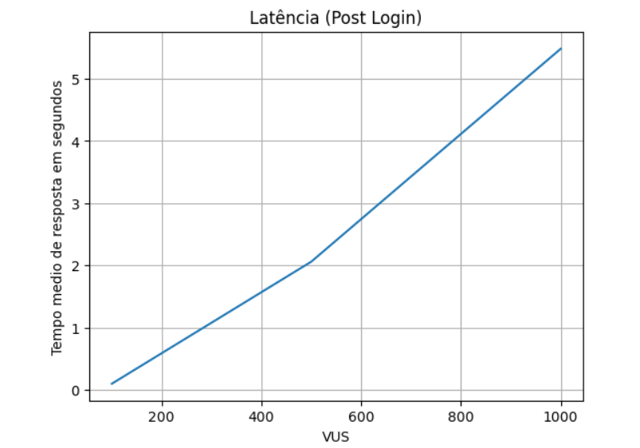

- Vazão (100 VUs; 500 VUs; 1000 VUs): 47.075428/s; 120.375143/s; 127.570201/s

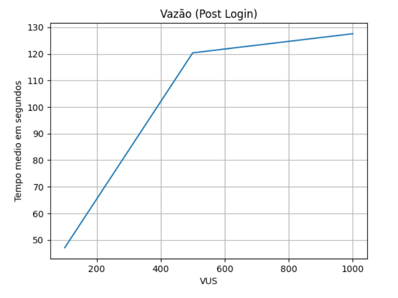

- Concorrência (100 VUs; 500 VUs; 1000 VUs): 56; 124; 120

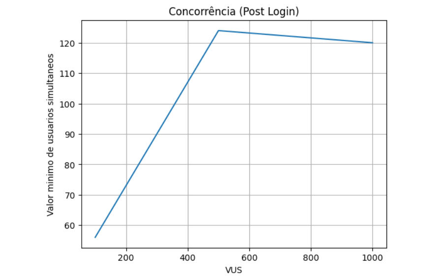

**Potenciais gargalos do sistema:** Não ter cache de informação do usuário para realizar autenticação.

## Post Cadastro
**Tipo de operações:** inserção

**Arquivos envolvidos:** [AuthController.java](https://github.com/Edhet/enem-questions/blob/feature/teste_de_carga/back-end/src/main/java/com/ablhds/Enemquestions/security/AuthController.java)

**Arquivos com o código fonte de medição do SLA:** [Post-Cadastro.js](https://github.com/Edhet/enem-questions/blob/feature/teste_de_carga/test/script_k6/scenarios/Post-Cadastro.js)

**Data da medição:** 07/08/2024

**Descrição das configurações:**
- Especificação do Computador:
    - Placa-Mãe: RB Jimny_RBH
    - CPU: Ryzen 5 7535HS 
    - GPU: NVIDIA RTX3050
    - Memória RAM: 1x8 GB 5600MHz
- Especificação dos Conteiners:
    - Nginx:  "image: 'nginx:1.25.5'"
    - Postgres: "image: 'postgres:alpine3.19'"
    - Redis: "image: 'redis:alpine3.19'"
    - Backend: "dockerfile: ./Dockerfile"

**Testes de carga (SLA):** 
- Latência (100 VUs; 500 VUs; 1000 VUs): 0.22505s; 4.63s ; 8.47s

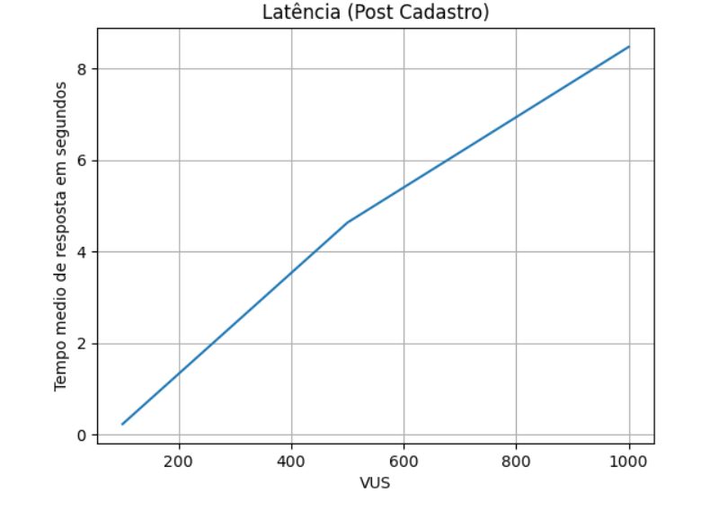

- Vazão (100 VUs; 500 VUs; 1000 VUs): 80.016331/s; 84.596332/s; 94.768434/s

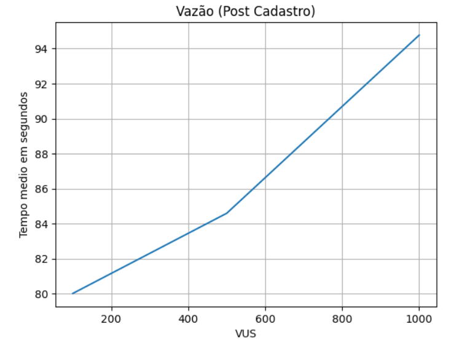

- Concorrência (100 VUs; 500 VUs; 1000 VUs): 15; 105; 33

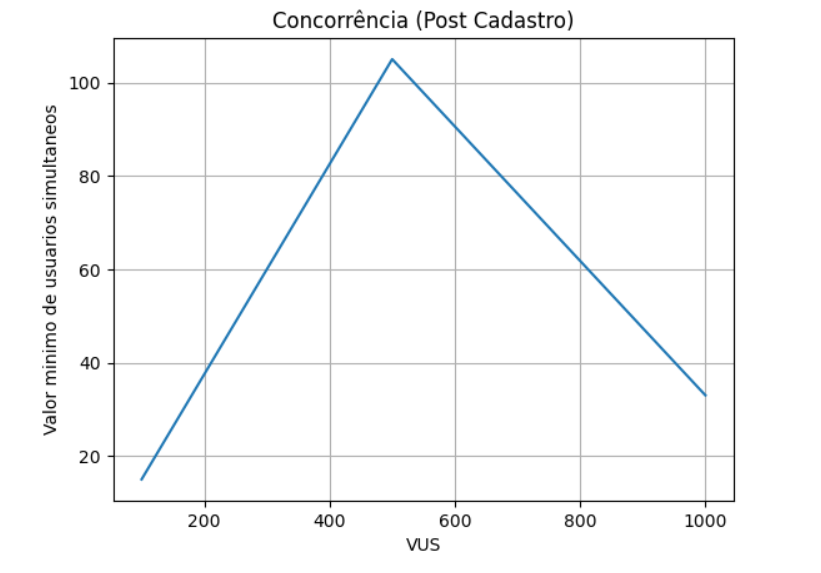

**Potenciais gargalos do sistema:** Não ter cache de informação do usuário para realizar autenticação.