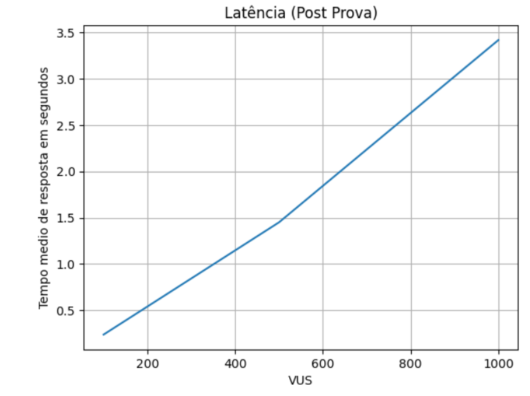
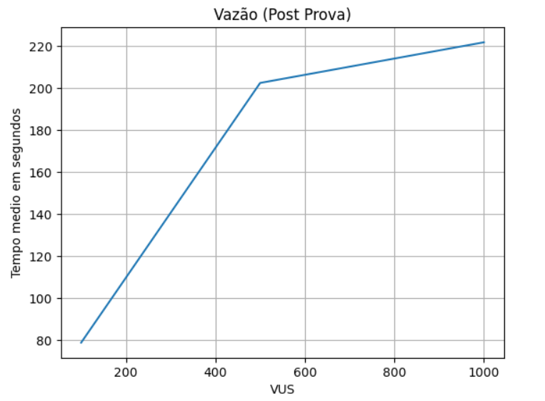
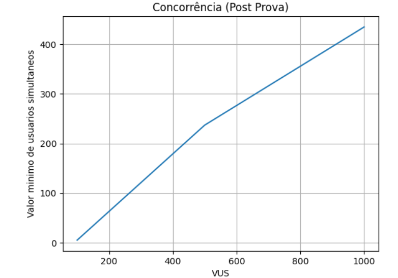

# MEDIÇÕES DO SLA

## Get Prova
**Tipo de operações:** leitura

**Arquivos envolvidos:** (lista de Arquivos c/ os links contidos no repositório que estejam envolvidos na implementação do serviço 1)

**Arquivos com o código fonte de medição do SLA:** [script_k6\scenarios\Get-Prova.js](script_k6\scenarios\Get-Prova.js)

**Data da medição:** 07/08/2024

**Descrição das configurações:** (máquinas/containers utilizadas para o sistema funcionar, ...)

**Testes de carga (SLA):** 
- Latência (100 VUs; 500 VUs; 1000 VUs): 16.35s; 22s ; 28.36s
- Vazão (100 VUs; 500 VUs; 1000 VUs): 5.245761/s; 13.887726/s; 23.49267/s
- Concorrência (100 VUs; 500 VUs; 1000 VUs): 90; 138; 190

**Potenciais gargalos do sistema:** Não ter cache de informação do usuário para realizar autenticação.

## Post Prova
**Tipo de operações:** inserção

**Arquivos envolvidos:** (lista de Arquivos c/ os links contidos no repositório que estejam envolvidos na implementação do serviço 2)

**Arquivos com o código fonte de medição do SLA:** enem-questions\test\script_k6\scenarios\Post-Prova.js

**Data da medição:** 07/08/2024

**Descrição das configurações:** (máquinas/containers utilizadas para o sistema funcionar, ...)

**Testes de carga (SLA):** 
- Latência (100 VUs; 500 VUs; 1000 VUs): 0.23637s; 1.45s ; 3.42s

- Vazão (100 VUs; 500 VUs; 1000 VUs): 78.948975/s; 202.34887/s; 221.660231/s

- Concorrência (100 VUs; 500 VUs; 1000 VUs): 5; 237; 435

**Potenciais gargalos do sistema:** Não ter cache de informação do usuário para realizar autenticação.

## Post Login
**Tipo de operações:** inserção

**Arquivos envolvidos:** (lista de Arquivos c/ os links contidos no repositório que estejam envolvidos na implementação do serviço 3)

**Arquivos com o código fonte de medição do SLA:** enem-questions\test\script_k6\scenarios\Post-Login.js

**Data da medição:** 07/08/2024

**Descrição das configurações:** (máquinas/containers utilizadas para o sistema funcionar, ...)

**Testes de carga (SLA):** 
- Latência (100 VUs; 500 VUs; 1000 VUs): 0.09855s; 2.06s ; 5.48s
- Vazão (100 VUs; 500 VUs; 1000 VUs): 47.075428/s; 120.375143/s; 127.570201/s
- Concorrência (100 VUs; 500 VUs; 1000 VUs): 56; 124; 120

**Potenciais gargalos do sistema:** Não ter cache de informação do usuário para realizar autenticação.

## Post Cadastro
**Tipo de operações:** inserção

**Arquivos envolvidos:** (lista de Arquivos c/ os links contidos no repositório que estejam envolvidos na implementação do serviço 4)

**Arquivos com o código fonte de medição do SLA:** enem-questions\test\script_k6\scenarios\Post-Cadastro.js

**Data da medição:** 07/08/2024

**Descrição das configurações:** (máquinas/containers utilizadas para o sistema funcionar, ...)

**Testes de carga (SLA):** 
- Latência (100 VUs; 500 VUs; 1000 VUs): 0.22505s; 4.63s ; 8.47s
- Vazão (100 VUs; 500 VUs; 1000 VUs): 80.016331/s; 84.596332/s; 94.768434/s
- Concorrência (100 VUs; 500 VUs; 1000 VUs): 15; 105; 33

**Potenciais gargalos do sistema:** Não ter cache de informação do usuário para realizar autenticação.